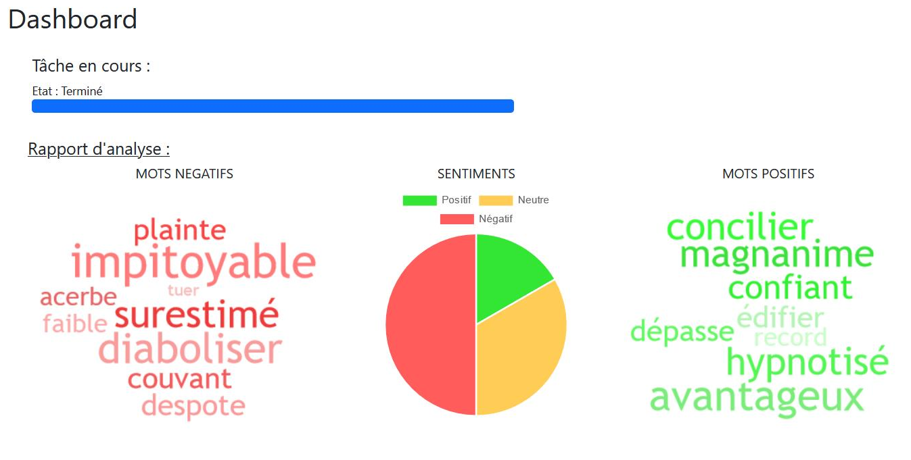
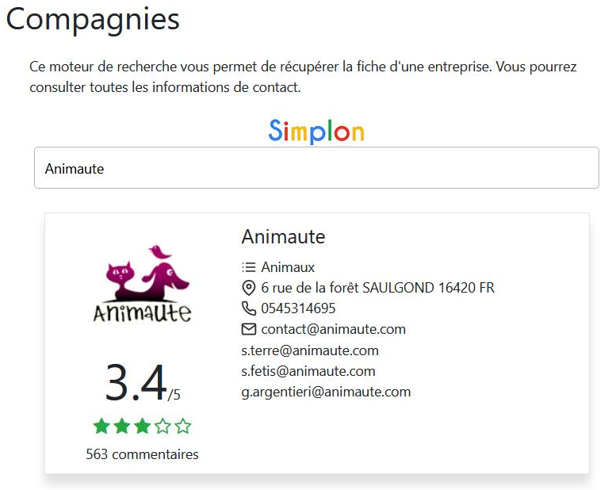

# Etude de marché par sentiment analysis

# Subject
## Context of project
You work for a company that offers a market research service to its users. To the many existing services, you are asked to add an API offering an overview of the feelings that your users' prospects have (via Trustpilot, Google, etc.) towards competing companies.

This API will be connected to a new dashboard developed in parallel by the web hub, which will be offered to your customers. The API will allow at least ** to retrieve, for a domain and a given locality, a json offering the data necessary for the establishment of an efficient dashboard.

To do this, you will need to offer reflections on the presentation of the data, and the results obtained by your model and more broadly your API. Returning full reviews? Return of all the meaningful words for a given establishment and sentiment? Return of each feeling, of a proportion? Differentiation of global reviews and recent reviews to observe trends? It is up to you to lead the reflection upstream of the production of the API. You can in these reflections, request the hierarchy.
# How to use
## Download the Project
```bash
git clone https://github.com/tjohanne42/api_nlp_trustpilot.git
cd api_nlp_trustpilot
pip install requirements.txt
python main.py starts the API  
```
Run in your browser  
https://your_address_ip:8000/docs  
To access the documentation.  
You can run https://your_address_ip:8000/redoc aswell.
# Example of usage
After starting API you can start:  
dashboard/index.html  
Our client web example  
You can obtain dashboard with wordclouds, sentiment analysis:

You can obtain more informations on specific company:

## This API use CamemBert, a french model of NLP
We used transfer learning on this model with our dataset  
Data are based on TrustPilot  
# Contibutors:
## Jean-Marie, David, Théo
